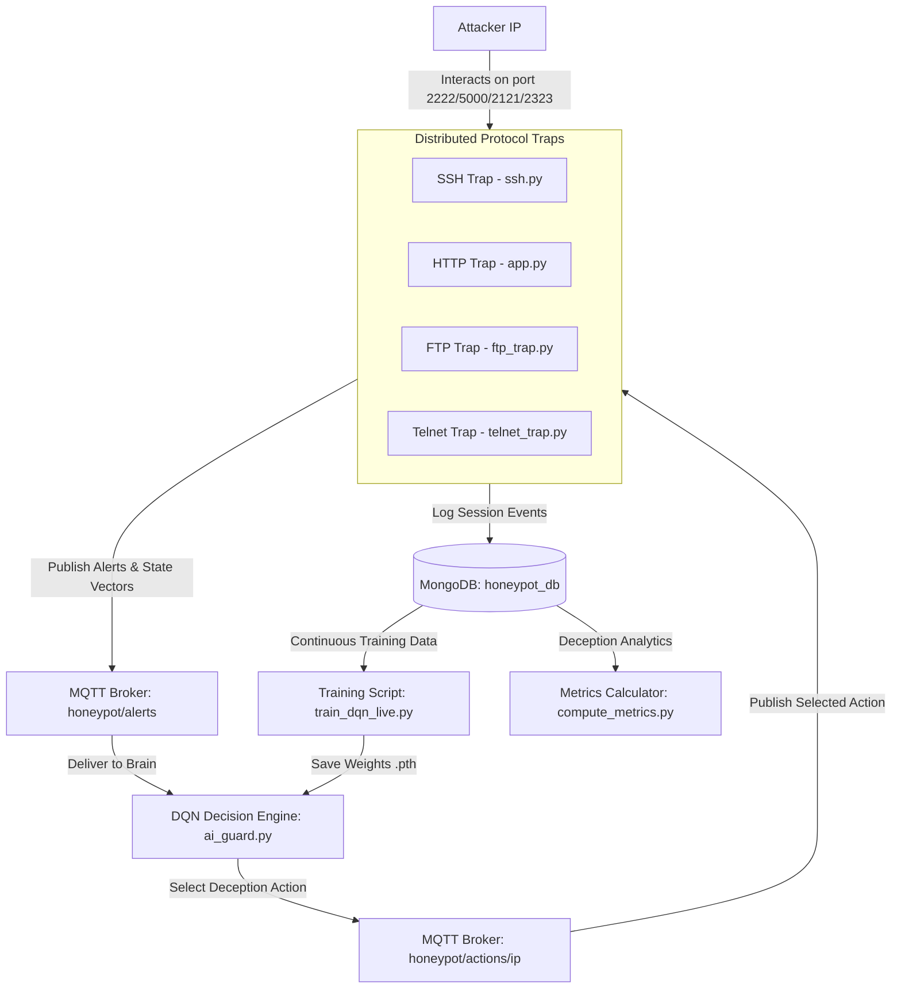

# RL-Driven High-Interaction IoT Honeypot for Adaptive Attacker Engagement

An autonomous, distributed, and adaptive cyber deception framework for Internet of Things (IoT) environments. This system integrates multiple protocol-specific traps (SSH, HTTP, FTP, Telnet) and leverages a Deep Q-Network (DQN) reinforcement learning agent to dynamically select deception strategies, maximizing attacker dwell time and threat intelligence collection.

This repository implements the architecture and research detailed in the paper **"RL-Driven High-Interaction IoT Honeypot for Adaptive Attacker Engagement"** by *Kainuru Balaji* and *Dr. Neha Agarwal* (Department of Computer Science, Indian Institute of Information Technology, Sri City).

---

## 📖 Abstract

Traditional IoT honeypots rely on static configurations and predefined responses, making them easy for sophisticated attackers to identify and evade. This project proposes an adaptive multi-honeypot framework designed for IoT environments. Leveraging a Deep Q-Network (DQN)-based decision engine communicating via the lightweight **MQTT protocol**, the system dynamically adapts its response strategy (e.g., tarpitting, honeytoken exposure, fake privilege escalation, WAF block) based on real-time attacker behavior.

By modeling attacker interaction as a sequential decision-making process, the framework calibrated progressive trust to sustain adversarial engagement, successfully improving attacker dwell time and capturing high-quality threat intelligence (malware samples, command sequences, and credentials).

---

## 🏗️ System Architecture

The framework consists of four distributed, protocol-specific traps, a centralized Deep Reinforcement Learning (DRL) decision engine, an MQTT communication broker, and a MongoDB logging database.



### 1. Centralized DQN Brain (`ai_guard.py`)
- Employs independent DQN agents for SSH, HTTP, FTP, and Telnet.
- Listens to the `honeypot/alerts` topic, decodes the state representation vector, performs epsilon-greedy action selection, and publishes the chosen action back to the trap via `honeypot/actions/{attacker_ip}`.
- Saves model weights to local files (`ssh_dqn.pth`, `http_dqn.pth`, `ftp_dqn.pth`, `telnet_dqn.pth`).

### 2. Protocol Traps
- **SSH Trap (`ssh.py` on Port 2222)**: Emulates a BusyBox-based embedded Linux terminal using Paramiko. Features a custom credential login phase (rejects the first 1-2 attempts to simulate realistic authentication behavior), a fake file system (`/root`, `/etc/shadow`, etc.), a fake `sudo` trap that captures password attempts, and staged honeytoken exposure.
- **HTTP Trap (`app.py` on Port 5000)**: Simulates a SCADA IoT Gateway telemetry admin panel. Exposes credential comments inside HTML, registers firmware upload requests to capture malicious binaries, and can trigger hCaptcha or WAF blocks to frustrate automated scanners.
- **FTP Trap (`ftp_trap.py` on Port 2121)**: Simulates a vsFTPd 3.0.3 server with active/passive transfer modes. Exposes mock firmware binaries and credentials, logs uploaded files into MongoDB, and tarpits download/upload transfers.
- **Telnet Trap (`telnet_trap.py` on Port 2323)**: Emulates an ash BusyBox router shell. Features a "Mirai Magnet" designed to lure automated botnets by letting `wget` or `curl` succeed to log external payloads. Also simulates NVRAM configuration dumps leaking dummy secrets.

---

## 📊 Behavioral State Representation

To generalize state spaces across varying protocols, attacker behavior is abstracted into a $5$-dimensional state vector:

$$S = [f_1, f_2, f_3, f_4, f_5]$$

| Feature | Description | SSH Semantics | HTTP Semantics | FTP Semantics | Telnet Semantics |
| :--- | :--- | :--- | :--- | :--- | :--- |
| **$f_1$ (II)** | Input Intensity | Command Length | Payload Size | Command Length | Command Length |
| **$f_2$ (IC)** | Interaction Count | Command Count | Request Count | Login Attempts | Command Count |
| **$f_3$ (TL)** | Threat Level | Risk (1-5) | Malicious Flag (0/1) | Risk (1-5) | Risk (1-5) |
| **$f_4$ (ED)** | Engagement Depth | Step Depth | Active Count | Command Count | Login Attempts |
| **$f_5$ (CF)** | Context Feature | Sudo Attempts | Scanner Flag (0/1) | File Transfer Count | Step Depth |

---

## 🧠 Reinforcement Learning & Reward Design

The DQN network consists of fully connected layers mapping the 5 input features to Q-values for $N$ service-specific actions:
- **SSH (6 actions)**: Limited Shell, Full Shell, Fake Sudo, Honeytoken Expose, Tarpit, Controlled Failure.
- **HTTP (5 actions)**: Live Dashboard, Fake Admin Panel, WAF Block, Tarpit, Captcha Ratelimit.
- **FTP (5 actions)**: Fake Filesystem, Honeytoken Retrieval, Tarpit Data Conn, Fake Stor Accept, Login Rejected.
- **Telnet (5 actions)**: BusyBox Shell, Invalid Loop, Tarpit, Wget Bait, Config Reveal.

### Reward Function
The goal of the agent is to maximize attacker engagement (dwell time) and interaction depth:

$$R = \begin{cases} 
\frac{T}{60} & \text{if terminal state (session end)} \\ 
\alpha + \beta \cdot f(s, a) & \text{otherwise} 
\end{cases}$$

- $T$: Session duration in seconds.
- $f(s,a)$: Intermediate reward shaping (bonuses for actions corresponding to high-quality data collection, e.g., triggering fake sudo during credential-harvesting).

---

## 📈 Evaluation Metrics (`compute_metrics.py`)

The framework calculates three research-grade cybersecurity deception metrics:

### 1. Behavioral Engagement Index (BEI)
Measures the richness of the attacker's session by combining dwell time, command count, privilege attempts, and honeytoken interactions:

$$BEI = 0.4 \cdot D + 0.3 \cdot C + 0.2 \cdot P + 0.1 \cdot H$$

- $D$: Normalized dwell time (capped at 600s).
- $C$: Normalized command count (capped at 50).
- $P$: Normalized privilege attempts (capped at 10).
- $H$: Normalized honeytoken hits (capped at 5).

### 2. Deception Retention Rate (DRR)
Evaluates if attackers remain engaged or immediately disengage after encountering adaptive deception (e.g., tarpitting or staged key exposure):

$$DRR = \frac{\text{Sessions continuing after deception}}{\text{Total sessions exposed to deception}} \times 100$$

### 3. Escalation Persistence Score (EPS)
Tracks attacker behavior after their first privilege escalation attempt (e.g., running `sudo`):

$$EPS = \frac{\text{Commands typed after first privilege attempt}}{\text{Total commands in session}}$$

---

## 📁 Repository Structure

```
├── ai_guard.py         # Centralized DQN Brain listening to MQTT alerts
├── app.py              # HTTP SCADA Gateway telemetry dashboard trap
├── ssh.py              # Paramiko-based BusyBox SSH shell trap
├── ftp_trap.py         # vsFTPd firmware repository emulator trap
├── telnet_trap.py      # ash Telnet router shell & "Mirai Magnet" trap
├── train_dqn_live.py   # DQN agent bootstrap & continuous training script
├── compute_metrics.py  # Deception metrics (BEI, DRR, EPS) calculator
├── README.md           # Documentation
└── *.pth               # Pre-trained DQN model weights (generated/saved)
```

---

## 🚀 Setup & Execution

### Prerequisites

Ensure you have Python 3.10+ installed along with MongoDB and an MQTT Broker (like Eclipse Mosquitto).

1. Install Python dependencies:
   ```bash
   pip install paho-mqtt pymongo torch paramiko pandas
   ```

2. Start MongoDB and Mosquitto MQTT Broker:
   - On Windows: Run MongoDB and Mosquitto services.
   - On Linux/Docker:
     ```bash
     sudo systemctl start mongod
     sudo systemctl start mosquitto
     ```

### Running the Honeypot System

1. **Start the centralized DQN Brain:**
   ```bash
   python ai_guard.py
   ```
   *The script will load pre-trained weights (`*_dqn.pth`) if present and wait for MQTT connections.*

2. **Start the Traps (in separate terminals):**
   - **SSH Trap:**
     ```bash
     python ssh.py
     ```
   - **HTTP Trap:**
     ```bash
     python app.py
     ```
   - **FTP Trap:**
     ```bash
     python ftp_trap.py
     ```
   - **Telnet Trap:**
     ```bash
     python telnet_trap.py
     ```

### Training the DQN Agents

You can train the models using `train_dqn_live.py` in three modes:
1. **Bootstrap Mode (Pre-training):** Trains agents using synthetic attack traces or an NSL-KDD dataset to initialize baseline policies.
   ```bash
   python train_dqn_live.py --mode bootstrap --kdd-path KDDTrain+.txt
   ```
2. **Live Mode (Batch Training):** Retrains agents using a batch of historical records retrieved from MongoDB.
   ```bash
   python train_dqn_live.py --mode live --mongo mongodb://localhost:27017/ --epochs 10
   ```
3. **Continuous Mode:** Runs indefinitely, pulling fresh session records from MongoDB and performing online network updates.
   ```bash
   python train_dqn_live.py --mode continuous --mongo mongodb://localhost:27017/
   ```

### Analyzing Attacker Deception Metrics

Evaluate system performance by fetching MongoDB logs and computing BEI, DRR, and EPS:
```bash
python compute_metrics.py --mongo mongodb://localhost:27017/
```
*Optional parameters: `--service SSH` to filter by protocol, `--csv results.csv` or `--json results.json` to export results.*
